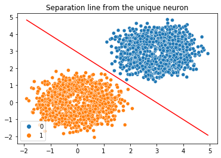

# Data Science - Neural Network

## Goal
This reposiory intends to show how neural networks work and to make an exploration on different data and algorithms.

The linear unique neuron can be found at:

```
Neural_network_unique_neuron.ipynb
```
and for people who want just to visualize:
```
Neural_network_unique_neuron.pdf
```
The result of one neuron classification can be seen as



## Requisitos

To reproduce results, make sure you have installed:
- Python 3.8.3
- Pandas 1.1.0
- Numpy 1.19.1
- Sklearn 0.23.2
- Keras 2.4.3
- Matplolib 3.2.1
- Seaborn 0.11.0

## Direitos autorais

O problema original foi elaborado pelo grupofleury-datascience/data-science-test.

A solução por Bruno Caldas <bruno.caldas@gmail.com>


